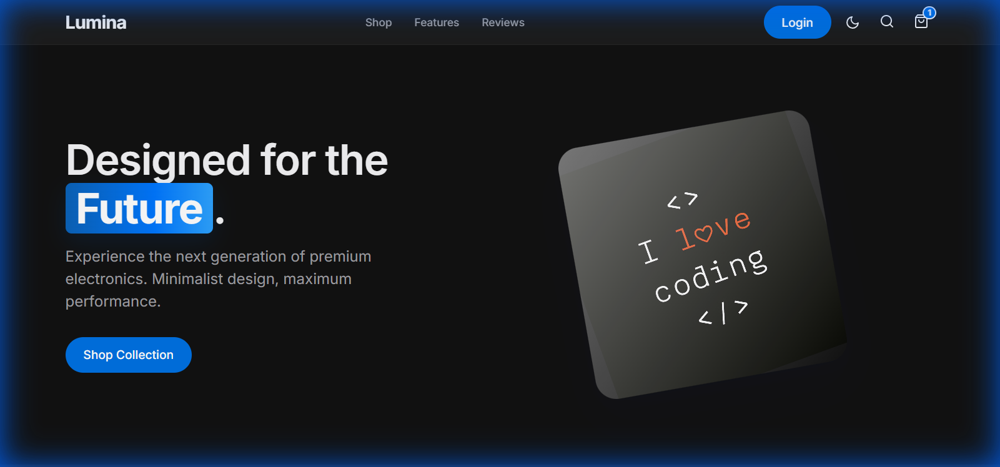

# Lumina | Premium Electronics Ecommerce

<div align="center">
  
  <br>
  <h3>Premium electronics for the modern professional.</h3>
</div>

## 📄 Overview

**Lumina** is a full-featured, modern ecommerce application designed for selling high-end electronic products. It prioritizes a premium user experience with a minimalist aesthetic, smooth interactions, and a responsive layout. The application includes a complete shopping workflow from product browsing to checkout, along with user authentication and an admin dashboard.

## ✨ Features

- **Storefront**

  - **Dynamic Product Grid:** Filter products by category (Audio, Wearables, Smart Home) and price range.
  - **Product Details:** Modal-based quick view with image galleries and detailed descriptions.
  - **Shopping Cart:** Slide-out cart drawer with real-time total calculation and quantity management.
  - **Checkout Flow:** Multi-step checkout process (Info > Shipping > Confirm).

- **UI/UX**

  - **Dark Mode:** Fully supported system-aware dark/light theme toggle.
  - **Responsive Design:** Optimized for mobile, tablet, and desktop views.
  - **Interactive Elements:** Smooth transitions, hover effects, and instant feedback.

- **Backend & Auth**
  - **User Authentication:** Secure Login and Sign Up functionality using JWT/Session.
  - **Admin Dashboard:** Access for administrators to manage store settings (backend accessible).
  - **API Integration:** Frontend connected to a Node.js/Express backend.

## 🛠️ Tech Stack

**Frontend**

- HTML5
- CSS3 (Custom Properties, Flexbox/Grid)
- JavaScript (ES6+, Vanilla)
- Fonts: Inter (Google Fonts)

**Backend**

- Node.js
- Express.js
- MongoDB (Mongoose)
- Authentication: Bcryptjs, JSON Web Token (JWT)

## 🚀 Getting Started

To run this project locally, follow these steps:

### Prerequisites

- Node.js (v14 or higher)
- npm (Node Package Manager)
- MongoDB instance (local or Atlas connection string)

### Installation

1. **Clone the repository**

   ```bash
   git clone https://github.com/codewithdisloyal/lumina-eCommerce.git
   cd lumina-eCommerce
   ```

2. **Install Dependencies**

   ```bash
   npm install
   ```

3. **Configure Environment**

   - Create a `.env` file in the root directory (if required by `server.js`) and add your MongoDB URI and JWT Secret.

4. **Run the Application**

   ```bash
   # Start the server (default port likely 3000 or 5000)
   npm start

   # Or for development with nodemon
   npm run dev
   ```

5. **Open in Browser**
   - Visit `http://localhost:3000` (or the port specified in your console).

## 👤 Author

**codewithdisloyal**

- GitHub: [@codewithdisloyal](https://github.com/codewithdisloyal)

---

_Built with ❤️ by codewithdisloyal_
